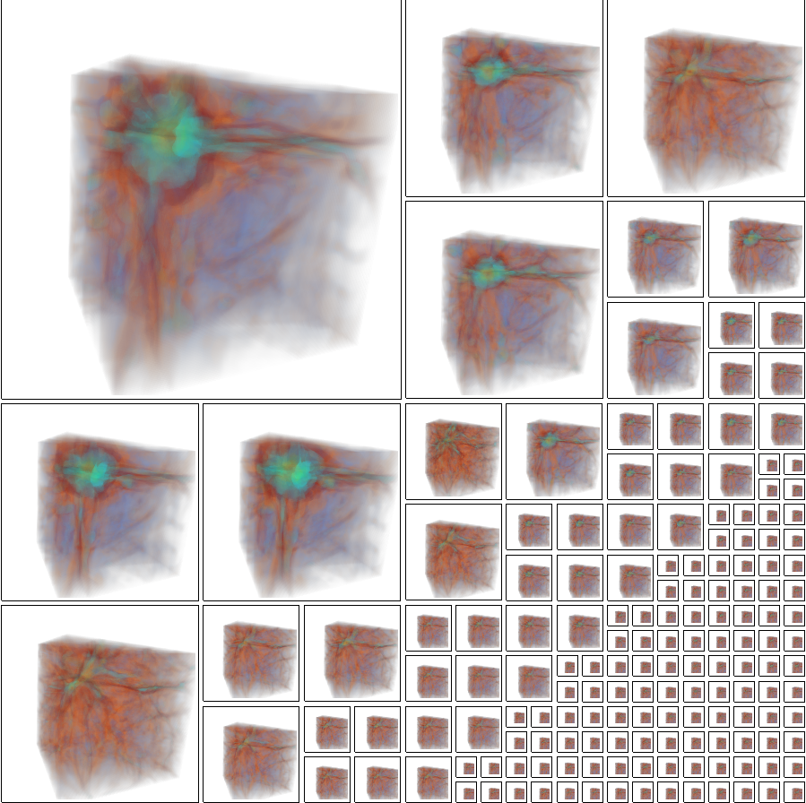
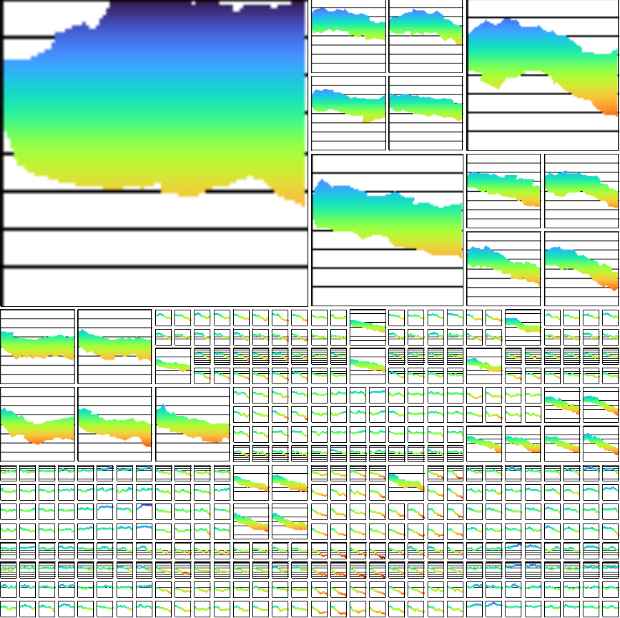
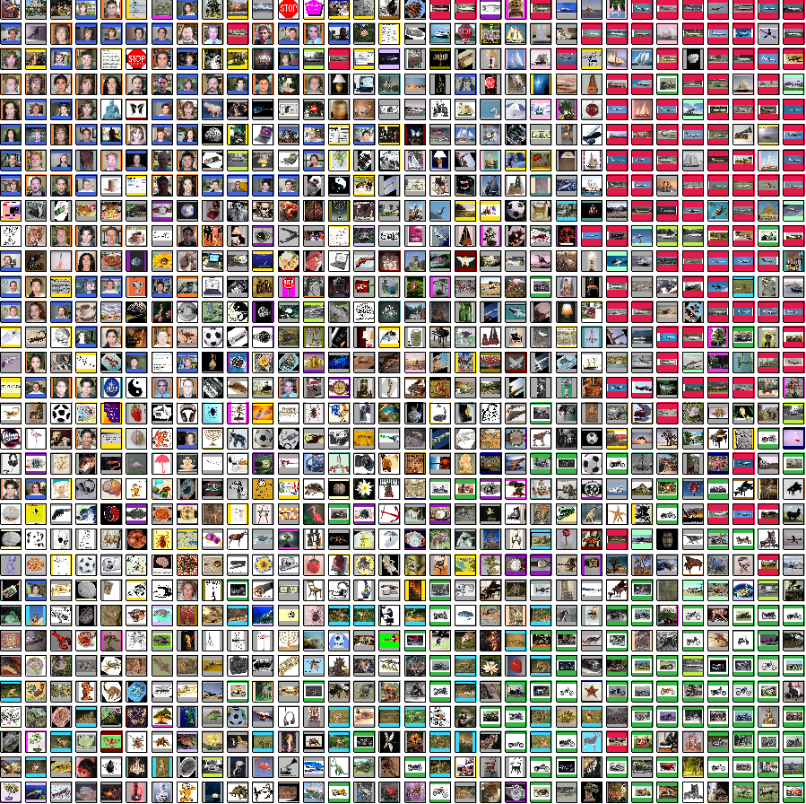

# LDG-SSM Interface

    
    
    

The LDG-SSM Interface is a visualization application for hierachical dataset exploration. It uses hierarchical dataset grid sortings generated by the [LDG-SSM](https://github.com/DavidHidde/ldg-ssm) sorting method to visualize datasets.

## Getting started

The LDG-SSM is made using the Qt application framework and OpenGL. To build and run the interface locally, the following dependencies need to be met:

* Qt 6.7.0
* OpenGL 4.1
* BZip2

For most systems, only installing Qt should suffice. The interface was tested on an M2 MacBook Pro using MacOS Sonoma 14.5.

## Dataset support

The interface uses a JSON configuration file for parsing datasets. These files are generated automatically by the [LDG-SSM](https://github.com/DavidHidde/ldg-ssm) and consist of:

* An overarching configuration file
* A disparity configuration and data buffer
* A visualization configuration and data buffer (containing images or volumes)
* An assignment file, mapping the members of the visualization buffer to the grid itself

The interface has 2 visualization modes: Images and 3D volumes. The distinction between these two modes is based on the indicated data size, with dataset member with a third dimension greater than 4 being interpreted as volumes.

## Controls

After opening a dataset, the dataset can be freely explored using left click to expand parents into their children and right click to collapse children into their parents. Next to the visible user interface, a couple of keybinds are supported:

| Key/Action        | Modifier   | Description                                            |
|-------------------|------------|--------------------------------------------------------|
| `0`-`9`           |            | Select a grid height.                                  |
| `R`               |            | Reset the zoom level and the rotation/zoom of volumes. |
| `+`               | `⌘`/`Ctrl` | Zoom in.                                               |
| `-`               | `⌘`/`Ctrl` | Zoom out.                                              |
| `O`               | `⌘`/`Ctrl` | Open a new file.                                       |
| Mouse drag        | `⌘`/`Ctrl` | Rotate a volume.                                       |
| Mousewheel scrool | `⌘`/`Ctrl` | Zoom in/out of a volume.                               |
